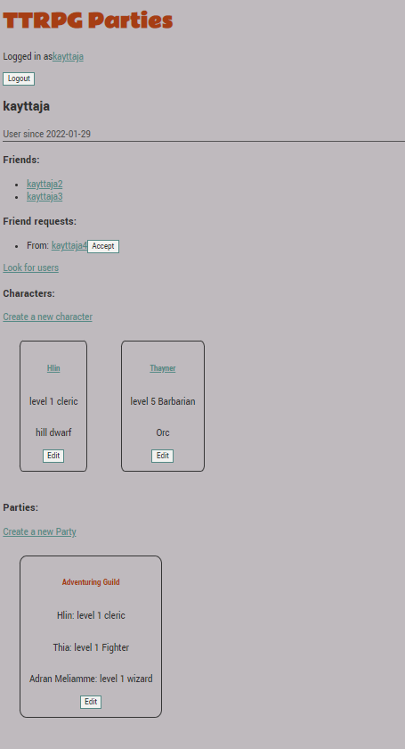

## TTRPG Parties: Käyttöohje

Sovelluksen tarkoitus on antaa käyttäjän luoda hahmoja pöytäroolipeleihin,
pyytää toisia käyttäjiä ystäviksi, ja luoda ryhmiä hahmoille.

Sovelluksen etusivulla voi kirjautua sisään tai luoda uuden käyttäjän.
Sovelluksella on pari käyttäjää jo luotuna, voit käyttää näitä tunnuksia
esimerkiksi ystävä-mekaniikkoja testaamista varten.
Käyttäjätunnus: kayttaja
Salasana: gxLjxkFtYi

Testikäyttäjän profiilisivu näyttää tältä:
